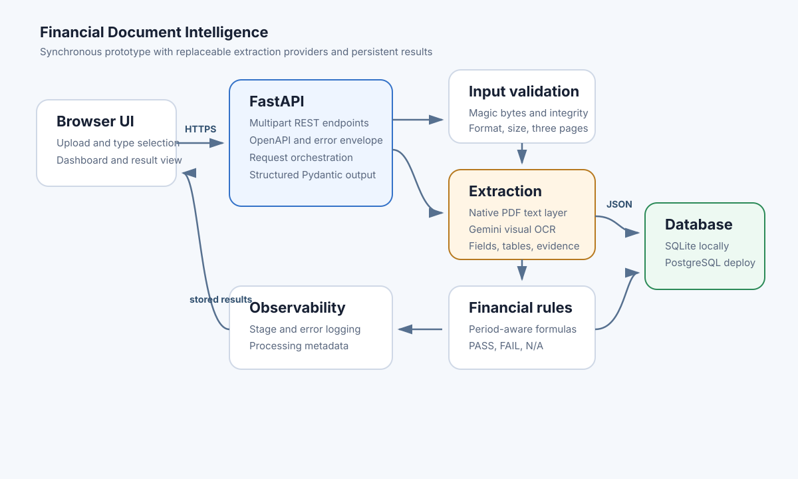

# Financial Document Intelligence

A deployable FastAPI application that validates PDF, JPG, and PNG financial documents, extracts grounded fields and tables, performs deterministic financial checks, stores the latest result by document name, and exposes the result through REST APIs and a database-backed HTML dashboard.

The supplied financial-statement PDFs are image-only. Configure a Gemini API key for those files and for JPG or PNG invoices. Native PDFs with a usable text layer can run through the local fallback without an external model, with more limited table recovery.

## What is implemented

- Four caller-selected document types: invoice, balance sheet, profit and loss, and cash flow statement.
- Magic-byte, extension, MIME, size, readability, corruption, encryption, and three-page checks before extraction.
- Native PDF text-layer parsing plus Gemini multimodal OCR and JSON-schema extraction for scanned PDFs and images.
- Dynamic extraction of all visible fields, comparative periods, evidence text, page numbers, and complete table rows.
- Explainable confidence based on evidence completeness, not an arbitrary model self-rating.
- Period-aware invoice and financial-statement reconciliation with PASS, FAIL, and NOT_APPLICABLE states.
- SQLite for local use and PostgreSQL-ready SQLAlchemy persistence for deployment.
- Multipart process, latest-by-name lookup, list/search, and health APIs with consistent controlled errors.
- Responsive HTML/CSS/JavaScript dashboard, result viewer, failed/missing highlights, and raw JSON view.
- Automated tests for input validation, finance rules, negative values, and an end-to-end API/database flow.

## Architecture and processing flow

1. The browser or API client supplies the document type and a multipart file.
2. The input layer detects the real file type from bytes and checks integrity and page count.
3. The OCR service reads native PDF text when available.
4. The extraction service sends scans and images inline to Gemini visual document understanding, requesting a constrained JSON schema. Gemini supports inline PDF document processing and structured extraction; see the [official document-understanding guide](https://ai.google.dev/gemini-api/docs/document-processing) and [structured-output guide](https://ai.google.dev/gemini-api/docs/structured-output).
5. Deterministic Python rules use only extracted source values. Missing operands produce NOT_APPLICABLE.
6. The repository upserts the latest result for the file name and the dashboard reads the same stored data.

Code is separated across validation, text extraction, AI extraction, financial rules, orchestration, persistence, schemas, routes, and frontend assets.

## Technology choices

- **FastAPI and Pydantic:** typed contracts, multipart support, automatic Swagger/OpenAPI, and controlled validation errors.
- **SQLAlchemy:** the same repository works with local SQLite and deployed PostgreSQL.
- **pypdf and Pillow:** lightweight local integrity and page/image validation.
- **Gemini Interactions API over HTTPX:** native vision for the supplied image-only PDFs and invoice images without a server-side PDF rasterizer.
- **Vanilla HTML, CSS, and JavaScript:** small deployable frontend that calls the REST API directly.
- **Pytest:** fast unit and API integration coverage.

## Local setup

Python 3.11 or newer is recommended.

~~~bash
python -m venv .venv
# Windows
.venv\Scripts\activate
# macOS/Linux
source .venv/bin/activate

pip install -r requirements-dev.txt
copy .env.example .env
~~~

Load the values from .env in your shell or deployment environment, then set GEMINI_API_KEY to process scans and images.

~~~bash
uvicorn backend.app.main:app --reload
~~~

Open:

- Dashboard: http://127.0.0.1:8000/
- Swagger: http://127.0.0.1:8000/docs
- Health: http://127.0.0.1:8000/api/v1/health

Run tests:

~~~bash
pytest
~~~

## Environment variables

| Variable | Required | Default | Purpose |
|---|---:|---|---|
| DATABASE_URL | No | SQLite under data | Persistent database connection |
| GEMINI_API_KEY | For scans/images | empty | Gemini authentication |
| GEMINI_MODEL | No | gemini-3.7-flash | Extraction model; override without code changes |
| GEMINI_API_BASE | No | Google v1beta API | Provider base URL |
| GEMINI_API_REVISION | No | 2026-05-20 | Interactions API revision |
| MAX_FILE_SIZE_MB | No | 10 | Upload size limit; safe for inline image requests |
| MAX_DOCUMENT_PAGES | No | 3 | Page limit |
| FINANCIAL_TOLERANCE | No | 0.01 | Relative and minimum absolute reconciliation tolerance |
| MODEL_TIMEOUT_SECONDS | No | 90 | Provider timeout |
| LOG_LEVEL | No | INFO | Application log level |
| APP_ENV | No | development | Environment label |

Do not commit .env or real credentials.

## API examples

Process a document:

~~~bash
curl -X POST "http://127.0.0.1:8000/api/v1/documents/process" \
  -F "document_type=invoice" \
  -F "file=@invoice.jpg"
~~~

Retrieve the latest result by exact file name:

~~~bash
curl "http://127.0.0.1:8000/api/v1/documents/invoice.jpg"
~~~

List results for the dashboard:

~~~bash
curl "http://127.0.0.1:8000/api/v1/documents?limit=50&offset=0&q=invoice"
~~~

Health:

~~~bash
curl "http://127.0.0.1:8000/api/v1/health"
~~~

Errors consistently use:

~~~json
{"error":{"code":"UNSUPPORTED_FILE_TYPE","message":"Only PDF, JPG, JPEG, and PNG documents are supported."}}
~~~

## Structured extraction

The result contains document_name, supplied document_type, processing_status, file_validation, extracted_data, validation, and processing_metadata. Extracted data contains a dynamic list of key-value fields and a list of tables, so extraction is not limited to a small hardcoded schema. Each field can carry a period, section, raw value, source text, page number, and confidence.

Null is used for visible missing or unreadable values. The prompt explicitly prohibits inference. The service never stores uploaded document bytes; it stores only the structured result and metadata.

Confidence is deterministic:

- 0.80 when a non-null value exists.
- +0.10 when supporting source text exists.
- +0.05 when a page number exists.
- +0.03 when an exact raw value exists.
- -0.30 for explicit uncertain or unreadable markers.
- Null values receive 0.00; the score is capped at 0.98.

This score measures grounding completeness, not OCR probability.

## Financial validations

The configured tolerance is an absolute amount; a one-part-per-million relative allowance prevents floating-point noise on very large totals.

- **Invoice:** quantity x unit price ÷ line amount; item sum ÷ subtotal or total; subtotal + tax - discount ÷ total; tax-included displayed totals are handled; cash paid - total ÷ change.
- **Balance sheet:** total capital and liabilities (or liabilities and equity) ÷ total assets, independently per period.
- **Profit and loss:** interest earned + other income ÷ total income; interest expended + operating expenses + provisions ÷ total expenditure; income - expenditure ÷ profit before minority interest; profit before minority - minority interest ÷ attributable profit; current + brought forward profit ÷ amount available for appropriation.
- **Cash flow:** operating + investing + financing + FX adjustment ÷ net change; opening cash + net change + applicable other adjustment ÷ closing cash.
- Parenthesized or bracketed values are parsed as negative.
- A check with a missing required source operand is NOT_APPLICABLE, never guessed as zero.

A document can have processing_status=PASS and validation.overall_status=FAIL. This means extraction completed but the source figures did not reconcile. FAILED is reserved for an invalid file or unsuccessful extraction.

## Persistence

Document names are unique in the processed_documents table. Reprocessing the same name updates its stored result, so GET by name always returns the latest attempt. The dashboard list is ordered by processing time and supports search.

SQLite is convenient locally. The Render blueprint creates PostgreSQL and injects DATABASE_URL so results survive application restarts and redeploys.

## Deployment

render.yaml defines a Docker web service and PostgreSQL database. In Render:

1. Push this repository to a public GitHub repository.
2. Create a Blueprint from render.yaml.
3. Enter GEMINI_API_KEY as a secret.
4. Wait for the health check to pass.
5. Verify the dashboard, /docs, and /api/v1/health.

Submission URLs to fill after deployment:

- Frontend URL: **TO BE SET AFTER DEPLOYMENT**
- Backend API URL: **TO BE SET AFTER DEPLOYMENT**
- Swagger/OpenAPI URL: **TO BE SET AFTER DEPLOYMENT**
- Public GitHub repository: **TO BE SET AFTER PUSH**

The frontend and API are served by the same deployable service; their public base URL can be identical.

## Sample outputs

Representative response files are under sample_outputs. They demonstrate each supported document type, calculations, evidence, comparative periods, and an unsupported-file error. These are examples, not hardcoded runtime answers.

## Known limitations

- Scanned/image documents require GEMINI_API_KEY; the local fallback does not include Tesseract.
- The synchronous endpoint can approach platform request limits on slow provider calls.
- Model-based transcription can still make OCR errors; evidence and page references make human review possible.
- Financial component trees are document-specific. The prototype implements the mandatory named relationships but does not reconstruct arbitrary nested accounting hierarchies.
- Files larger than the configured limit and password-protected PDFs are rejected.
- The application stores structured output, not source files or page images.

## Production improvements

Use background jobs with idempotency keys, object storage, antivirus scanning, per-tenant access control, encryption, audit trails, retry/circuit-breaker policy, provider fallback, database migrations, row version history, human review queues, token and cost telemetry, rate limiting, and extraction regression sets with labeled ground truth.

## AI tool usage declaration

OpenAI Codex was used to extract the case-study requirements, scaffold the modular application, implement tests and documentation, and review the generated code. The financial formulas and error behavior are deterministic application code and can be inspected and modified without an AI model.

## Repository map

~~~text
backend/app/
  api/routes/documents.py
  core/
  models/
  repositories/
  schemas/
  services/
backend/tests/
frontend/templates/
frontend/static/
docs/architecture.svg
sample_outputs/
Dockerfile
render.yaml
.env.example
~~~
